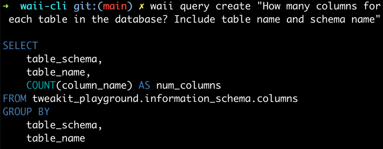
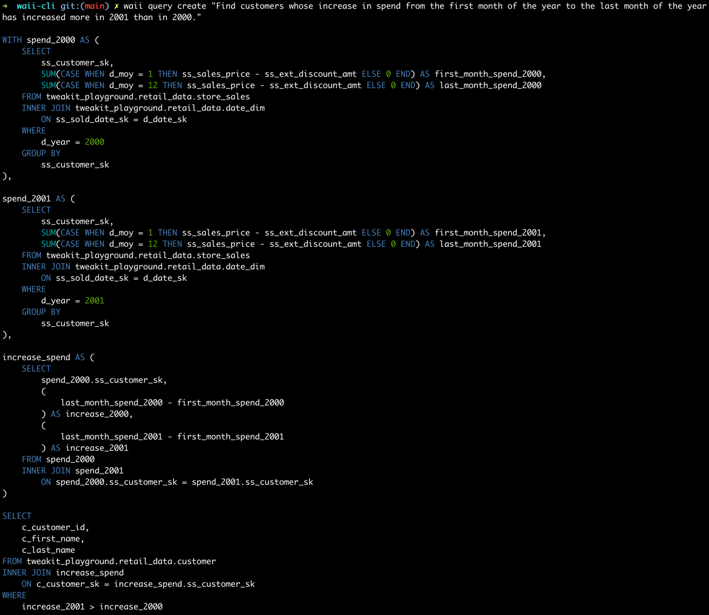

### Query related

#### Generate Query

```bash
waii query create "How many columns for each table in the database? Include table name and schema name"
```


```bash
waii query create "Find customers whose increase in spend from the first month of the year to the last month of the year has increased more in 2001 than in 2000."
```


#### Run Query

You can create a query then run it
```bash
waii query create "How many columns for each table in the database? Include table name and schema name" | waii query run
```

Output:
```
➜  waii-cli git:(main) ✗ waii query create "How many columns for each table in the database? \
                         Include table name and schema name" | waii query run
┌────────────────────┬─────────────────────────────────┬─────────────┐
│ TABLE_SCHEMA       │ TABLE_NAME                      │ NUM_COLUMNS │
├────────────────────┼─────────────────────────────────┼─────────────┤
│ CRUNCHBASE_2016    │ ADDITIONS                       │ 4           │
│ RETAIL_DATA        │ PROMOTION                       │ 19          │
│ PLAYGROUND         │ TEST_TABLE                      │ 1           │
│ INFORMATION_SCHEMA │ REPLICATION_GROUPS              │ 18          │
│ INFORMATION_SCHEMA │ ENABLED_ROLES                   │ 2           │
│ INFORMATION_SCHEMA │ TABLE_CONSTRAINTS               │ 14          │
...
```

You can directly run a query
```bash
cat <<EOF | waii query run
WITH joined_data AS (
    SELECT
        c.name AS country_name,
        ci.population AS city_population
    FROM tweakit_playground.world.city AS ci
    INNER JOIN tweakit_playground.world.country AS c
        ON ci.countrycode = c.code
)

SELECT
    country_name,
    AVG(city_population) AS avg_city_population
FROM joined_data
GROUP BY
    country_name
EOF
```

Output:
```
┌───────────────────────────────────────┬─────────────────────┐
│ COUNTRY_NAME                          │ AVG_CITY_POPULATION │
├───────────────────────────────────────┼─────────────────────┤
│ Afghanistan                           │ 583025              │
│ Netherlands                           │ 185001.75           │
│ Netherlands Antilles                  │ 2345                │
│ Albania                               │ 270000              │
│ Algeria                               │ 288454.388889       │
│ American Samoa                        │ 3761.5              │
│ Andorra                               │ 21189               │
│ Angola                                │ 512320              │
│ Antigua and Barbuda                   │ 24000               │
....
```

#### Describe a query
You can use this query as an example: [my-complex-query.sql](examples/my-complex-query.sql)

```bash
cat my-complex-query.sql | waii query describe
```

Output:
```
Summary:
--------
What is the percentage of the population that speaks the official language in each country?

Tables:
-------
WORLD.CITY
WORLD.COUNTRY
WORLD.COUNTRYLANGUAGE

Steps:
------
Step 1: Calculate the total population for each country by summing the population of all cities in that country.

Step 2: Calculate the population of people who speak the official language in each country by multiplying the 
        population of each city by the percentage of people who speak the official language.

...
```

#### Transcode a query (Translate a query to another SQL dialect)
You can use this query as an example: [pyspark.sql](examples/pyspark.sql)

Run the following command to transcode the PySpark query to Snowflake SQL:
```bash
cat pyspark.sql | waii query transcode -from pyspark -to snowflake
```

Output:
```
WITH joined_data AS (
    SELECT
        s.s_store_name,
        s.s_store_id,
        d.d_day_name,
        ss.ss_sales_price
    FROM tweakit_playground.retail_data.date_dim AS d
    INNER JOIN tweakit_playground.retail_data.store_sales AS ss
        ON d.d_date_sk = ss.ss_sold_date_sk
    INNER JOIN tweakit_playground.retail_data.store AS s
        ON s.s_store_sk = ss.ss_store_sk AND s.s_gmt_offset = -5
    WHERE
        d.d_year = 2000
)

SELECT
    s_store_name,
    s_store_id,
    
    ...
```

### Database related

#### List databases
```bash
waii database list
```

```
┌──────────────────┬────────────────────┬────────────┬───────────────────┬──────────────┐
│ account_name     │ database           │ warehouse  │ role              │ username     │
├──────────────────┼────────────────────┼────────────┼───────────────────┼──────────────┤
│ gq.........91428 │ TWEAKIT_PLAYGROUND │ COMPUTE_WH │ TWEAKIT_USER_ROLE │ TWEAKIT_USER │
└──────────────────┴────────────────────┴────────────┴───────────────────┴──────────────┘
```

#### Activate database

Waii CLI uses the active database to generate queries, get table information, etc. You can switch the active database by running the following command (URL can be found by running `waii database list`):
```bash
database activate <url_of_the_database>
```

### Table and Schema related

#### List your tables (under the current database)
```bash
waii table list
```

Output
```
➜  waii-cli git:(main) ✗ waii table list
┌──────────────────────────────────────────────────────────────────────────────────────────────────────────────────────────────────────┐
│ INFORMATION_SCHEMA                                                                                                                   │
├──────────────────────────────────────────────────────────────────────────────────────────────────────────────────────────────────────┤
│ ENABLED_ROLES                    TABLES                           COLUMNS                          SCHEMATA                          │
│ SEQUENCES                        VIEWS                            TABLE_PRIVILEGES                 USAGE_PRIVILEGES                  │
│ DATABASES                        REPLICATION_DATABASES            REPLICATION_GROUPS               FUNCTIONS                         │
│ PROCEDURES                       OBJECT_PRIVILEGES                FILE_FORMATS                     APPLICABLE_ROLES                  │
│ STAGES                           REFERENTIAL_CONSTRAINTS          TABLE_CONSTRAINTS                INFORMATION_SCHEMA_CATALOG_NAME   │
│ LOAD_HISTORY                     TABLE_STORAGE_METRICS            PIPES                            EXTERNAL_TABLES                   │
│ EVENT_TABLES                     PACKAGES                         STREAMLITS                       CLASS_INSTANCE_FUNCTIONS          │
│ CLASSES                          CLASS_INSTANCES                  CLASS_INSTANCE_PROCEDURES                                          │
│                                                                                                                                      │
└──────────────────────────────────────────────────────────────────────────────────────────────────────────────────────────────────────┘
┌──────────────────────────────────────────────────────────────────────────────────────────────────────────────────────────┐
│ RETAIL_DATA                                                                                                              │
├──────────────────────────────────────────────────────────────────────────────────────────────────────────────────────────┤
│ PROMOTION               STORE_SALES             ITEM                    STORE                   INVENTORY                │
│ DATE_DIM                HOUSEHOLD_DEMOGRAPHICS  TIME_DIM                CUSTOMER_ADDRESS        CUSTOMER                 │
│ CUSTOMER_DEMOGRAPHICS   CALL_CENTER             STORE_RETURNS           WAREHOUSE               INCOME_BAND              │
│ REASON                                                                                                                   │
│                                                                                                                          │
└──────────────────────────────────────────────────────────────────────────────────────────────────────────────────────────┘
```

#### Describe a schema (Get generated description of a schema)
```bash
waii schema describe RETAIL_DATA
```

Output:
```
Schema:
-------
TWEAKIT_PLAYGROUND.RETAIL_DATA

Description:
------------
The TWEAKIT_PLAYGROUND.RETAIL_DATA schema contains tables related to retail data analysis, including information about 
call centers, customers, addresses, demographics, dates, household demographics, income bands, inventory, items, 
promotions, reasons, stores, store returns, store sales, time dimensions, and warehouses. This schema can be used to 
analyze various aspects of retail operations, such as call center performance, customer demographics, inventory 
management, sales trends, and promotional effectiveness.

Tables:
-------
┌────────────────────────┐
│ table                  │
├────────────────────────┤
│ PROMOTION              │
│ STORE_SALES            │
│ ITEM                   │

Common Questions:
-----------------
What is the average number of employees in each call center?
How many customers are there in each country?
What is the average price of items in each category?
...
```

#### Get history of generated queries
```bash
waii history list
```

Output
```
┌──────────┬──────────────────────────────────────────────────────────────┐
│ property │ value                                                        │
├──────────┼──────────────────────────────────────────────────────────────┤
│ uuid     │ 6d58f192-b0d4-4672-9b57-f2652ba8268d                         │
├──────────┼──────────────────────────────────────────────────────────────┤
│ favorite │ false                                                        │
├──────────┼──────────────────────────────────────────────────────────────┤
│ question │ What is the average number of employees in each call center? │
├──────────┼──────────────────────────────────────────────────────────────┤
│ tables   │ RETAIL_DATA.CALL_CENTER                                      │
└──────────┴──────────────────────────────────────────────────────────────┘
Query:
---
SELECT
cc_call_center_id,
AVG(cc_employees) AS avg_employees
FROM tweakit_playground.retail_data.call_center
GROUP BY
cc_call_center_id
------------------------------------------------------------
<...More Generated Queries ...>
```

#### Extract documentations from web page / txt file, etc.

You may want to extract the documentation from a web page or a text file. You can use the following command to extract the documentation from a web page:

```bash
# Extract documentation from a web page, and update the database
waii database extract_doc --url "https://fleetdm.com/tables/chrome_extensions" --update true

# Extract documentation from a local text file, and display the documentation in the console
waii database extract_doc --file "path/to/file.txt" --doc_type text --update false

# Extract a html page from local file, and update the database
waii database extract_doc --file "path/to/file.html" --doc_type html --update true
```

Options: 
- `--file` : The URL of the web page or the path to the text file.
- `--doc_type`: The type of the documentation (only applies to `file`). It can be `html`, `text`. Default is `text`.
- `--url` : The URL of the web page. (Note that you can only use `--file` or `--url` at a time)
- `--update` : If set to `true`, the extracted documentation will be updated in the database. If set to `false`, the extracted documentation will be displayed in the console.
- `--tables` : The name of the tables where the documentation will be mapped to. By default we will search all the tables in the database.
- `--schemas` : The name of the schemas where the documentation will be mapped to. By default we will search all the schemas in the database.

